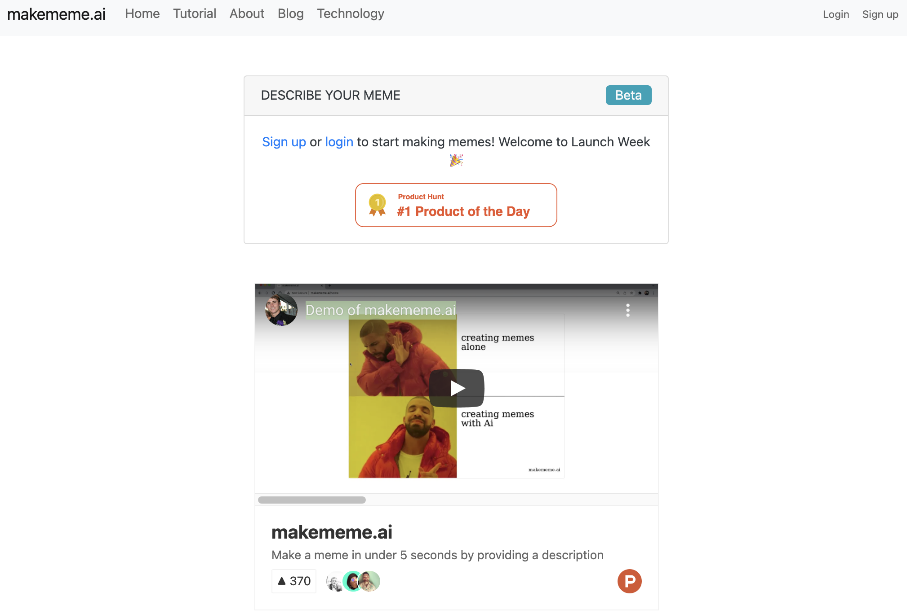

# [makememe.ai](http://makememe.ai/)

This project allows users can create memes in under 5 seconds by describing them with natural language. The AI system transforms the user's input into a meme. This project is a fun way for software developers to learn about AI and Python development. 

You are welcome to fork this repo and make adjustments or contributions. If you fork or clone the repo, it is first required to review OpenAI's [go live policy](https://beta.openai.com/docs/going-live). You will need your own access and key in order to contribute. 

## [The Site](http://makememe.ai/)
</img>

## [The Demo](https://www.producthunt.com/posts/makememe-ai)

[](https://www.producthunt.com/posts/makememe-ai)

# Setup the website locally

There are three steps required to get the makememe.ai app to run on your computer. 

1. Run flask server
2. Install OpenAI Key
3. Install and run Postgres server

## 1. Run Flask Server 
See the [code series](https://joshbickett.medium.com/making-memes-with-ai-db3332fc00ac) to learn more about the code base and how to contribute to the project. 

Create a [virtual environment](https://docs.python.org/3/library/venv.html)

```
python3 -m venv venv
```

Activate the environment 
```
source venv/bin/activate
```

Install all packages into venv
```
pip install -r requirements.txt
```

Run
```
python run.py
```

## 2. Install OpenAI Key

## 3. Install and run Postgres server

If you do not have Postgres installed, you will need to install it on you computer. 

Mac users you can do so with the following [Homebrew command](https://formulae.brew.sh/formula/postgresql): 

```
brew install postgresql
```

Then start postgressql

```
brew services start postgresql
```

